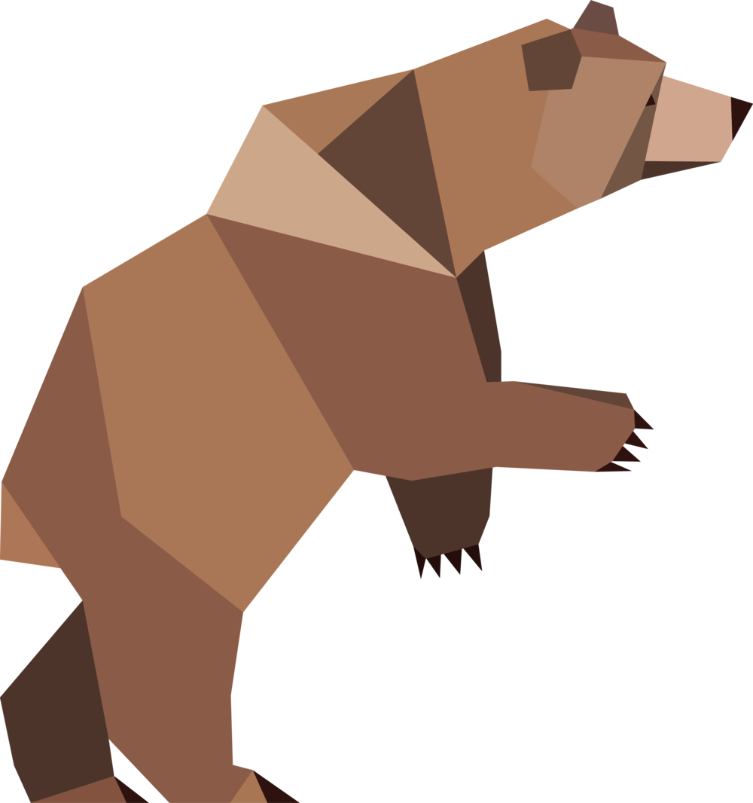

<a id="readme-top"></a>

<!-- PROJECT LOGO -->
<br />
<div align="center">
  <a href="https://github.com/Bear29ers/bear29ers.com">
    
  </a>

  <h3 align="center">Bear29ers' Portfolio Website</h3>

  <p align="center">
    A brand new portfolio website by Bear29ers.
    <br />
    <a href="https://bear29ers.com" target="_blank"><strong>bear29ers.com »</strong></a>
    <br />
    <br />
  </p>
</div>

<!-- TABLE OF CONTENTS -->
<details>
  <summary>Table of Contents</summary>
  <ol>
    <li>
      <a href="#about-the-project">About The Project</a>
      <ul>
        <li><a href="#built-with">Built With</a></li>
      </ul>
    </li>
    <li>
      <a href="#getting-started">Getting Started</a>
      <ul>
        <li><a href="#prerequisites">Prerequisites</a></li>
        <li><a href="#installation">Installation</a></li>
      </ul>
    </li>
    <li><a href="#contact">Contact</a></li>
  </ol>
</details>

<!-- ABOUT THE PROJECT -->

## 📙 About The Project

<div align="center">
  
</div>
<span>&nbsp;</span>
<div align="center">
  
</div>
<span>&nbsp;</span>
<div align="center">
  
  <span>&nbsp;</span>
  
</div>

<h4>Bear29ers' Portfolio: A Showcase of Frontend Innovation</h4>

This portfolio is a dynamic platform where I, as a frontend engineer, experiment with cutting-edge technologies and showcase my projects.

It serves as both a testing ground for new skills and a window into my development journey.

Here, you'll find a collection of my work that demonstrates my passion for creating engaging user interfaces and robust web applications.

As I continue to grow and learn, this site will evolve, reflecting my latest technical achievements and creative solutions.

I invite you to explore my projects and witness firsthand the results of my dedication to frontend development.

<p align="right">(<a href="#readme-top">back to top</a>)</p>

## 🛠️ Tech Stack

Listed major frameworks/libraries and devtools used to boost this project.

![NextJs] ![ReactJs] ![JavaScript] ![TypeScript] ![NodeJs] <br>
![Tailwind] ![HTML] ![CSS] ![Sass] <br>
![Eslint] ![Storybook] ![Jest] ![TestingLibrary] <br>
![Npm] ![Docker] ![Vercel] ![Neovim] ![WebStrom] <br>
![Git] ![Github] ![GithubActions]

<p align="right">(<a href="#readme-top">back to top</a>)</p>

<!-- GETTING STARTED -->

## 🎬 Getting Started

### 🎒 Prerequisites

- Node.js 20.0.0 or later
- Next.js 14.0 or later
- A basic understanding of TypeScript & React

### 🌱 Installation

1. Build with Dcoker

   ```bash
   docker compose build
   ```

2. Start the app (with Docker)

   ```bash
   docker compose up (-d)
   ```

   The port will be 5050.

3. Stop the app (with Docker)

   ```bash
   docker compose down
   ```

### 💻 Available commands

Running commands with npm `run [command]`

| command        | description                                                    |
| -------------- | -------------------------------------------------------------- |
| `dev`          | starts a development instance of the app on local (not docker) |
| `build`        | build the app                                                  |
| `eslint:fix`   | run eslint with fix option                                     |
| `prettier:fix` | run prettier with fix option                                   |
| `test`         | testing                                                        |
| `storybook`    | open storybook                                                 |

<p align="right">(<a href="#readme-top">back to top</a>)</p>

<!-- CONTACT -->

## ✉️ Contact

[![Gmail]](mailto:y.dream.nest@gmail.com) <br>
[![Instagram]](https://www.instagram.com/bear29ers/)

<p align="right">(<a href="#readme-top">back to top</a>)</p>

<!-- MARKDOWN LINKS & IMAGES -->

[NextJs]: https://img.shields.io/badge/next.js-000000?style=for-the-badge&logo=nextdotjs&logoColor=white
[ReactJs]: https://img.shields.io/badge/React-20232A?style=for-the-badge&logo=react&logoColor=61DAFB
[JavaScript]: https://img.shields.io/badge/JavaScript-323330?style=for-the-badge&logo=javascript&logoColor=F7DF1E
[TypeScript]: https://img.shields.io/badge/TypeScript-007ACC?style=for-the-badge&logo=typescript&logoColor=white
[NodeJs]: https://img.shields.io/badge/Node.js-43853D?style=for-the-badge&logo=node.js&logoColor=white
[HTML]: https://img.shields.io/badge/HTML5-E34F26?style=for-the-badge&logo=html5&logoColor=white
[CSS]: https://img.shields.io/badge/CSS3-1572B6?style=for-the-badge&logo=css3&logoColor=white
[Sass]: https://img.shields.io/badge/Sass-CC6699?style=for-the-badge&logo=sass&logoColor=white
[Tailwind]: https://img.shields.io/badge/Tailwind_CSS-38B2AC?style=for-the-badge&logo=tailwind-css&logoColor=white
[Eslint]: https://img.shields.io/badge/ESLint-4B3263?style=for-the-badge&logo=eslint&logoColor=white
[Storybook]: https://img.shields.io/badge/-Storybook-FF4785?style=for-the-badge&logo=storybook&logoColor=white
[Jest]: https://img.shields.io/badge/Jest-323330?style=for-the-badge&logo=Jest&logoColor=white
[TestingLibrary]: https://img.shields.io/badge/testing%20library-323330?style=for-the-badge&logo=testing-library&logoColor=red
[Npm]: https://img.shields.io/badge/NPM-%23CB3837.svg?style=for-the-badge&logo=npm&logoColor=white
[Docker]: https://img.shields.io/badge/docker-%230db7ed.svg?style=for-the-badge&logo=docker&logoColor=white
[Vercel]: https://img.shields.io/badge/vercel-%23000000.svg?style=for-the-badge&logo=vercel&logoColor=white
[Git]: https://img.shields.io/badge/git-%23F05033.svg?style=for-the-badge&logo=git&logoColor=white
[Github]: https://img.shields.io/badge/github-%23121011.svg?style=for-the-badge&logo=github&logoColor=white
[GithubActions]: https://img.shields.io/badge/github%20actions-%232671E5.svg?style=for-the-badge&logo=githubactions&logoColor=white
[Neovim]: https://img.shields.io/badge/NeoVim-%2357A143.svg?&style=for-the-badge&logo=neovim&logoColor=white
[WebStrom]: https://img.shields.io/badge/webstorm-143?style=for-the-badge&logo=webstorm&logoColor=white&color=black
[Gmail]: https://img.shields.io/badge/Gmail-D14836?style=for-the-badge&logo=gmail&logoColor=white
[Instagram]: https://img.shields.io/badge/Instagram-%23E4405F.svg?style=for-the-badge&logo=Instagram&logoColor=white
